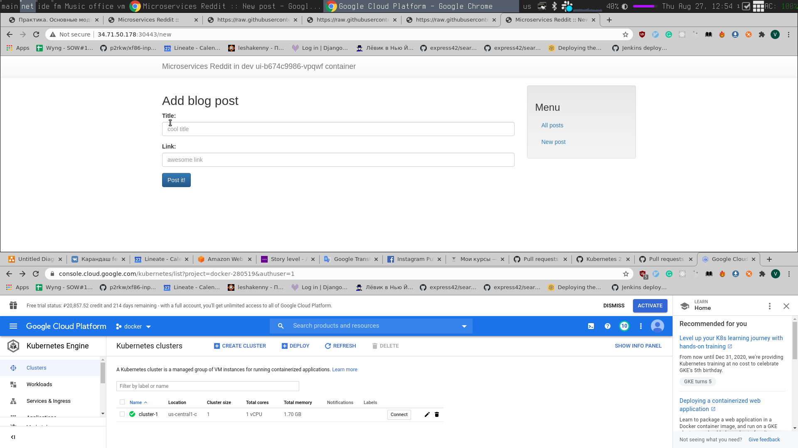

# vsvlasov_microservices
vsvlasov microservices repository

# ДЗ-12 "Технология контейнеризации. Введение в Docker"

##### Добавлен Docker, Dockerfile для сборки reddit images
Сборка образа:
```shell script
cd docker-monolith
docker build -t reddit:latest .
```
Паблишинг образа в Docker Hub:
```shell script
docker tag reddit:latest <your-login>/otus-reddit:1.0
docker push <your-login>/otus-reddit:1.0
```

##### Добавлены Terraform, Ansible, Packer
Собрать базоый образ docker-host с использованием Packer:
```shell script
cd docker-monolith/infra
packer build --var-file ./packer/variables.json ./packer/docker-host.json
```

Запуск инстансов GCP с Terraform:
```shell script
cd docker-monolith/infra/terraform
terraform apply
```

Запуск приложения внутри докера с использованием Ansible:
```shell script
cd docker-monolith/infra/ansible
ansible-playbook ./playbooks/site.yml
```

##### Other
- Добавлены pre-commit hooks
- Настроен travis


# ДЗ-13 "Docker-образы Микросервисы"
- Добавлены Dockerfile для post/comment/ui
- Оптимизированы размеры образов ui и comment

##### Оптимизация размеров образов ui и comment
- Сборка реализована через multi-stage build.
- Использован alpine дистрибутив
Итоговый размер каждого образа ~60 Мб

##### Сборка образов
Для сборки образов необходимо выполнить в директории `src`
```shell script
docker build -t <name>:<version> ./ui/
docker build -t <name>:<version> ./comment/
docker build -t <name>:<version> ./post-py/
```

##### Network alias
При смене алиасов приложение перестает работать.
Чтобы заменить ENV без пересборки образа, необходимо передать новые ENV параметры.
```shell script
docker run -d --network=reddit --network-alias=post_db_new --network-alias=comment_db_new mongo:latest
docker run -d --network=reddit --network-alias=post_new --env POST_DATABASE_HOST=post_db_new vvlineate/post:1.0
docker run -d --network=reddit --network-alias=comment_new --env COMMENT_DATABASE_HOST=comment_db_new vvlineate/comment:1.0
docker run -d --network=reddit -p 9292:9292 --env POST_SERVICE_HOST=post_new --env COMMENT_SERVICE_HOST=comment_new vvlineate/ui:2.0
```

# ДЗ-14 "Docker: сети, docker-compose"

### Работа с сетями

1. `none` драйвер полностью изолирует докер контейнер от доступа к внешнему миру
2. `host` При использовании данного типа драйвера убирается изоляция между контейнером и Docker host,
что позволяет напрямую использовать сеть хоста
3. `bridge` Используется при необходимости иметь в сети N контейнеров, которым нужно коммуницировать

### Запуск нескольких контейнеров nginx `docker run --network host -d nginx`
Одновременно может быть запущен только один контейнер, т.к. он занимает порт

### Base project name
Имя формируется `<project_name>_<service_name>_<index>`.

По умолчанию в качестве `project_name` используется имя директории в которой находится yml файл.

Может быть изменен с помощью переменной `COMPOSE_PROJECT_NAME`
 или флага `-p, --project-name`

### Docker-compose
1. Добавлен параметризованный Docker compose конфиг с несколькими сетями
2. Добавлен override для конфига
 - Изменена команда запуска, добавлены флаги `--debug` `-w 2`
 - Директории с кодом смонтированы как volume


# ДЗ-15 Устройство Gitlab CI. Построение процесса непрерывной поставки
1. Добавлен скрипт для создания инстанса GCP с помощью docker-machine
2. Установлен GitLab с task runner'ами
3. Добавлен pipeline для тестирования, сборки и запуска динамических окружений приложения

### Установка GitLab
1. Создать инстанс GCP

       sh gitlab-ci/gitlab-gcp.sh

2. Запустить GitLab

       cd gitlab-ci
       docker-compose up -d

3. Зарегистрировать Task runner

       cd gitlab-ci
       sh runner.sh

4. Создать группу, проект

5. Добавить код в проект на gitlab

# ДЗ-16 Введение в мониторинг. Системы мониторинга.

- Добавлен prometheus для мониторинга
- Добавлены node-exporter, blackbox-exporter, mongodb-exporter для prometheus
- Добавлен Makefile для сбокри и пуша образов в DockerHub
- Образы запушены в DockerHub

### Запуск проекта
1. Создать GCP инстанс

       export GOOGLE_PROJECT=<your_project>
       docker-machine create --driver google \
         --google-machine-image https://www.googleapis.com/compute/v1/projects/ubuntu-os-cloud/global/images/family/ubuntu-1604-lts \
         --google-machine-type n1-standard-1 \
         --google-zone europe-west1-b \
         docker-host

2. Создать Firewall rules

       gcloud compute firewall-rules create prometheus-default --allow tcp:9090
       gcloud compute firewall-rules create puma-default --allow tcp:9292

3. Собрать и запушить образы

       make build_all
       make docker_push_all

4. Задеплоить приложение

       cd docker
       docker-compose -f docker-compose.yml up -d

### Проверка работоспособности
- Перейти по ссылке http://<YOUR_VM_IP>:9090
- Перейти по ссылке http://<YOUR_VM_IP>:9292


# ДЗ-17 Мониторинг приложения и инфраструктуры
- Добавлен мониторинг cAdvisor
- Добавлена Grafana для визуализации метрик с дашбордами
- Добавлен сбор метрик с Docker
- Добавлен сбор метрик telegraf
- Добавлен алертинг в Slack

### Запуск проекта
1. Создать GCP инстанс

       docker-machine create --driver google \
          --google-machine-image https://www.googleapis.com/compute/v1/projects/ubuntu-os-cloud/global/images/family/ubuntu-1604-lts \
          --google-machine-type n1-standard-1 \
          --google-zone europe-west1-b \
          docker-host

2. Создать Firewall rules

       gcloud compute firewall-rules create prometheus-default --allow tcp:9090
       gcloud compute firewall-rules create puma-default --allow tcp:9292
       gcloud compute firewall-rules create grafana-default --allow tcp:3000
       gcloud compute firewall-rules create cadvisor-default --allow tcp:8080

3. Собрать и запушить образы

       make build_all
       make docker_push_all

4. Задеплоить приложение

       make run_app

       или

       cd ./docker
       docker-compose -f docker-compose-monitoring.yml up -d
       docker-compose -f docker-compose.yml up -d

5. Импортировать дашборды Grafana

       Перейти по ссылке http://<YOUR_VM_IP>:3000
       Добавить Prometheus source
       Импортировать дашборды с папки ./monitoring/grafana/dashboards

### Проверка работоспособности
- Перейти по ссылке http://<YOUR_VM_IP>:8080 и проверить, что cAdvisor собирает метрики
- Перейти по ссылке http://<YOUR_VM_IP>:9090 и проверить, что в targets prometheus есть метрики с Docker, telegraf, etc.
- Перейти по ссылке http://<YOUR_VM_IP>:3000 Проверить дашборды Grafana


# ДЗ-19 Логирование и распределенная трассировка
- Добавлен EFK для сбора и визуализации логов
- Добавлен Zipkin для трассировки
- Добавлена обработка неструктурированных логов для UI сервиса
- Проанализирован bugged-code с использованием Zipkin

       Из трассировки видно, что db_find_single_post всегда занимает ~3 секунды.
       Решение: Удалить time.sleep(3) из кода.

1. Создать GCP инстанс

       docker-machine create --driver google \
           --google-machine-image https://www.googleapis.com/compute/v1/projects/ubuntu-os-cloud/global/images/family/ubuntu-1604-lts \
           --google-machine-type n1-standard-1 \
           --google-open-port 5601/tcp \
           --google-open-port 9292/tcp \
           --google-open-port 9411/tcp \
           logging

2. Собрать и запушить образы

       make build_all
       make docker_push_all

3. Задеплоить приложение

       make run_app

       или

       cd ./docker
       docker-compose -f docker-compose-logging.yml up -d
       docker-compose -f docker-compose.yml up -d

### Проверка работоспособности
- Открыть приложение по ссылке http://<YOUR_VM_IP>:9292
- Перейти по ссылке http://<YOUR_VM_IP>:5601 проверить работоспособность Kibana
- Перейти по ссылке http://<YOUR_VM_IP>:9411 В Zipkin должна отображаться трассировка (В случае если ранее осуществлялся переход в приложение)


# ДЗ-19 Введение в Kubernetes
- Развернут K8S кластер в GCP по [Hard Way](https://github.com/kelseyhightower/kubernetes-the-hard-way)
- Добавлена [документация](./kubernetes/the_hard_way/README.md) со списком шагов и заметками при возникновении проблем
- Сделан смоук тестинг
- Задеплоены тестовые поды

### Запуск проекта
- Выполнить шаги из [Hard Way](https://github.com/kelseyhightower/kubernetes-the-hard-way)
Решение возникших проблем описано в [документации](./kubernetes/the_hard_way/README.md)
- Задеплоить поды reddit

### Проверка работоспособности
- Провести Smoke test в соответствии с The Hard Way
- `kubectl get po` должен показать поды reddit


# ДЗ-19 Введение в Kubernetes
- Развернут K8S кластер в GCP по [Hard Way](https://github.com/kelseyhightower/kubernetes-the-hard-way)
- Добавлена [документация](./kubernetes/the_hard_way/README.md) со списком шагов и заметками при возникновении проблем
- Сделан смоук тестинг
- Задеплоены тестовые поды

### Запуск проекта
- Выполнить шаги из [Hard Way](https://github.com/kelseyhightower/kubernetes-the-hard-way)
Решение возникших проблем описано в [документации](./kubernetes/the_hard_way/README.md)
- Задеплоить поды reddit

### Проверка работоспособности
- Провести Smoke test в соответствии с The Hard Way
- `kubectl get po` должен показать поды reddit


# ДЗ-20 Kubernetes. Запуск кластера и приложения. Модель безопасности.
- Добавлены поды для приложения
- Настроена сеть, добавлены k8s сервисы
- Добавлен Terraform
- Добавлен RBAC для dashboard

Скриншот приложения в GCP



### Запуск проекта
- Задеплоить GKE с использованием terraform

      cd kubernetes/terraform
      terraform init
      terraform apply

- Задеплоить namespace

      cd kubernetes
      kubectl apply -f ./reddit/dev-namespace.yml

- Задеплоить приложение

      cd kubernetes
      kubectl apply -f ./reddit/. -n dev

- Задеплоить RBAC

      cd kubernetes
      kubectl apply -f ./dashboard/. -n dev

### Проверка работоспособности
- `kubectl get po -n dev` должен вернуть поды приложения
- `kubectl get svc -n dev` должен вернуть сервисы приложения
- Открыть UI приложения http://<external_ip>:<node_port>

        kubectl get nodes -o wide  # Взять external-ip
        kubectl describe service ui -n dev | grep NodePort   # Взять NodePort


# ДЗ-21 Kubernetes. Networks ,Storages
- Добавлен UI load balancer
- Load balancer заменен на ingress контроллер
- Добавлен TLS + k8s secret
- Ограничен http доступ
- Ограничен доступ к Mongo извне
- Добавлены различные volumes для mongodb

### Запуск проекта
- Задеплоить GKE с использованием terraform

      cd kubernetes/terraform
      terraform init
      terraform apply

- Задеплоить namespace

      cd kubernetes
      kubectl apply -f ./reddit/dev-namespace.yml

- Задеплоить приложение

      cd kubernetes
      kubectl apply -f ./reddit/. -n dev

- Сгенерировать TLS сертификат

      kubectl get ing -n dev  # Получить INGRESS_IP
      openssl req -x509 -nodes -days 365 -newkey rsa:2048 -keyout tls.key -out tls.crt -subj "/CN=<INGRESS_IP"  # Генерация ключа
      Добавить сертификат и ключ в kubernetes/reddit/ui-ingress-secret.yml
      kubectl apply -f kubernetes/reddit/ui-ingress-secret.yml -n dev  # Создать secret

### Проверка работоспособности
- Получить ingress ip `kubectl get ing ui -n dev`
- Перейти по ссылке https://<INGRESS_IP>
- `kubectl get svc -n dev` должен вернуть сервисы приложения
